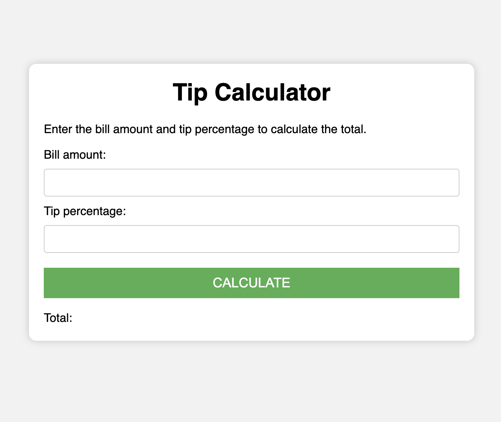

# Tip Calculator
A simple tip calculator web application that allows users to calculate the total amount including tips based on the bill amount and tip percentage entered.

# Usage
1. Fork the repository
2. Clone or download the repository.
   
    ```bash
        git clone https://github.com/your-username/tip-calculator.git
3. Open the index.html file in your web browser.

# Features
- **Bill Amount Input:** Enter the bill amount in the designated input field.
- **Tip Percentage Input:** Enter the tip percentage you want to apply.
- **Calculate Button:** Click the "Calculate" button to compute the total amount.
- **Total Display:** View the calculated total amount below the "Total" label.

# Preview


# How to Contribute
If you'd like to contribute to the development of this tip calculator, follow these steps:

1.  Fork the repository.
2. Create a new branch
    ```bash
    git checkout -b feature/new-feature.
3. Make your changes.

4. Commit your changes 
    ```bash
    git commit -m 'Add new feature'
5. Push to the branch 
    ```bash
    git push origin feature/new-feature
6. Create a new Pull Request.


# Thank You 🌟
Thank you for checking out the Tip Calculator! If you have any suggestions, feedback, or improvements, feel free to contribute. Your support is greatly appreciated. Happy calculating! 